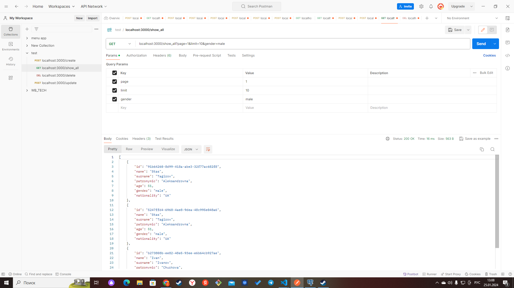
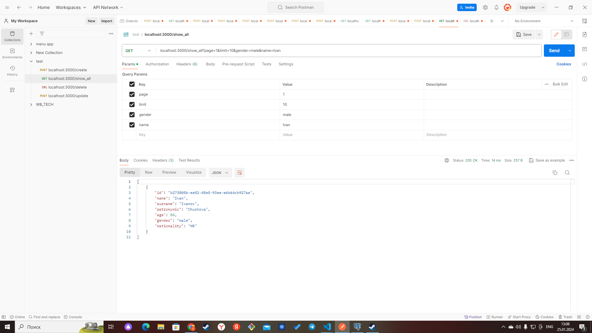

Для запуска программы укажите в env файле значения для переменной окружения
POSTRGRES_CONNECTION=  
Файл .env должен быть в папке cmd  
Запустите postgers любым удобным вам способом и выполните команду go run main.go из папки cmd  
Запросы для postman в файле test.postman_collection.json можно импортировать  
Есть пагинация и фильтры по Имени Фамилии Возрасту Гражданству Полу
Примеры

